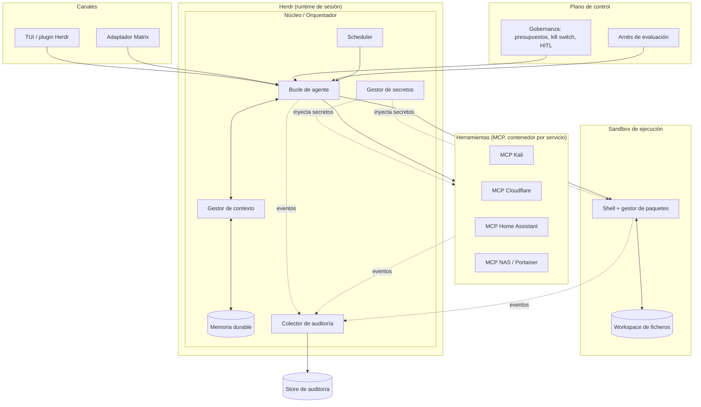

# Requisitos técnicos — Arnés de agentes personal

> **Nombre del proyecto:** Argos
> **Estado:** Borrador · **v0.2**
> **Fecha:** 2026-09-27
> **Autor:** lliwi
> **Propósito del documento:** punto de partida del repositorio. Define objetivos, alcance, principios de diseño, requisitos funcionales/no funcionales y roadmap. Es un documento vivo; cada requisito lleva un ID estable para poder referenciarlo en issues, commits y decisiones de arquitectura (ADR). Los cambios respecto a v0.1 están en el §22 (Changelog).

---

## 1. Visión y objetivos

Construir un arnés de agentes autoalojado que actúe como asistente personal para tareas del día a día, y que **al mismo tiempo sea un vehículo de aprendizaje** sobre cómo funcionan los arneses por dentro (con posible transferencia a un entorno profesional).

Objetivos, en orden de prioridad:

1. **Aprender el oficio.** El valor no está en el bucle del agente (comoditizado), sino en resolver los problemas difíciles: gestión de contexto, coste en tokens, degradación con el tiempo, orquestación de herramientas, **observabilidad** y **evaluación**.
2. **Ser auditable, evaluable y didáctico.** Todo lo que hace el sistema debe poder inspeccionarse a posteriori y **medirse**: qué ficheros toca, qué comandos ejecuta, qué herramientas invoca, dónde acierta y dónde falla, y cuánto cuesta. La auditoría + la evaluación son el bucle de mejora del sistema y de quien lo desarrolla.
3. **Resolver tareas reales** de forma segura: OSINT, auditoría de servicios web propios, gestión/monitorización de infraestructura y tareas personales/recordatorios.
4. **Ser seguro y respetuoso con la ley por diseño**, dada la mezcla de superficies (datos no confiables + credenciales + tooling ofensivo) y el tratamiento de datos de terceros.

### 1.1 Casos de uso objetivo

| ID | Dominio | Descripción | Nota |
|----|---------|-------------|------|
| UC-1 | OSINT | Investigación, descubrimiento y obtención de fuentes; análisis de brechas de datos. | Implica datos personales de terceros → ver §3. |
| UC-2 | Pentest | Auditoría de servicios web **propios** mediante un MCP de Kali, con alcance explícito. | Requiere autorización documentada → ver §3. |
| UC-3 | Infra | Monitorización y gestión de NAS, Cloudflare, Portainer, Home Assistant, etc. | Acciones destructivas con HITL → ver §13. |
| UC-4 | Personal | Recordatorios y tareas cotidianas. | — |

---

## 2. Alcance

### 2.1 Dentro del alcance (v1)
- Núcleo orquestador con bucle de agente y gestión de contexto.
- Ejecución nativa de shell en sandbox e instalación de paquetes.
- Sistema de _skills_ (instrucciones) y _tools_ (MCP) con carga diferida.
- Subsistemas de **observabilidad/auditoría** y **evaluación/pruebas**.
- Canales: TUI/hospedado en Herdr y Matrix.
- Scheduler para tareas recurrentes y disparadas por eventos.
- Segmentación de seguridad por perfiles/máquinas y **gobernanza de ejecución** (presupuestos, kill switch, HITL).

### 2.2 Fuera del alcance (por ahora)
- Interfaz web pública de cara a terceros.
- Multi-usuario / multi-tenant.
- Entrenamiento o fine-tuning de modelos.
- Cualquier uso ofensivo contra sistemas que no sean propios o sin autorización explícita.
- Vigilancia, perfilado o reidentificación de personas físicas más allá de lo estrictamente necesario y lícito.

---

## 3. Marco legal, ético y de protección de datos

Dado que el sistema trata datos personales de terceros (OSINT, análisis de brechas) y ejecuta acciones potencialmente ofensivas (pentest), este marco es un requisito, no una recomendación.

- **RF-LEG-01 — Autorización de pentest.** Toda auditoría ofensiva se ejecuta únicamente contra sistemas propios o con **autorización escrita** verificable. El alcance (hosts/dominios permitidos) se define explícitamente y se rechaza cualquier objetivo fuera de él (ver RF-SEC-06).
- **RF-LEG-02 — Base legal y minimización.** El tratamiento de datos personales obtenidos por OSINT/brechas se limita a lo estrictamente necesario para la tarea; no se recopilan ni conservan datos superfluos.
- **RF-LEG-03 — Retención y purga.** Los datos personales de terceros tienen una retención configurable y por defecto corta, con purga automática al vencer.
- **RF-LEG-04 — Cifrado en reposo.** Datos sensibles recopilados y almacén de auditoría cifrados en reposo.
- **RF-LEG-05 — Marco aplicable.** Diseño alineado con el RGPD y el marco de la UE aplicable. El sistema no está destinado a vigilancia de personas ni a reidentificación innecesaria.
- **RF-LEG-06 — Trazabilidad legal.** Las autorizaciones de pentest y las bases de tratamiento quedan registradas y asociadas a las sesiones correspondientes.

---

## 4. Principios de diseño (rectores)

- **P1 — Desacoplar cerebro, canales y herramientas.** Los canales son adaptadores finos; el núcleo no sabe si le habla una TUI o Matrix.
- **P2 — Separar la superficie que lee datos no confiables de la que tiene poder.** Principio de seguridad central (defensa frente a _prompt injection_ indirecto).
- **P3 — El historial conversacional es desechable; el estado durable no.** La memoria de largo plazo vive fuera del transcript.
- **P4 — Todo es observable y medible.** Si una acción no deja traza, es como si no hubiera ocurrido. La auditoría y la evaluación son parte del contrato de cada componente.
- **P5 — Carga diferida por defecto.** Skills, tools y contexto entran solo cuando son relevantes (control de tokens y de degradación).
- **P6 — Fail-safe.** Ante duda, falta de aprobación, presupuesto agotado o error grave, el sistema **se detiene**, no continúa.
- **P7 — Reutilizar el runtime, construir el criterio.** Herdr como capa de sesión/persistencia; el núcleo, la memoria, la auditoría y la evaluación se construyen.
- **P8 — Reproducibilidad.** Cada ejecución captura las versiones exactas (prompt, skills, tools, config, commit, modelo) que la hicieron posible; sin esto no hay comparación ni aprendizaje fiable.

---

## 5. Arquitectura de referencia

- **Herdr** hospeda el núcleo como proceso CLI/TUI de larga duración: persistencia, _resume_, estado y **aislamiento por máquina vía SSH**.
- Cada **MCP** corre en su propio contenedor con credenciales _scoped_ inyectadas por el gestor de secretos.
- El **sandbox de ejecución** es donde el agente ejecuta shell e instala software, aislado del resto.
- El **plano de control** (gobernanza + evaluación) es transversal y puede intervenir/detener el núcleo.

---

## 6. Requisitos funcionales (RF)

### 6.1 Núcleo / orquestador
- **RF-01** El núcleo implementa el bucle: construir contexto → llamar al modelo → parsear _tool calls_ → ejecutar → registrar observación → repetir.
- **RF-02** Soporta **subagentes con contexto limpio**: una tarea acotada se delega a un subagente que devuelve solo el resultado destilado al padre.
- **RF-03** Detecta y corta **bucles** (repetición de la misma acción/error) con un límite configurable de iteraciones.
- **RF-04** Expone una **API interna** (socket/HTTP local) que los canales consumen; el núcleo es agnóstico al canal.
- **RF-05** Soporta **perfiles de agente** (OSINT, pentest, infra, personal) con conjuntos distintos de tools, skills, credenciales y políticas.
- **RF-19** Soporta **modo _dry-run_**: los perfiles/acciones sensibles pueden ejecutarse en simulación, registrando la acción prevista sin ejecutarla. Útil para pentest/infra y para aprender sin riesgo.

### 6.2 Canales
- **RF-06** Canal **TUI / plugin de Herdr** para interacción sincrónica.
- **RF-07** Canal **Matrix** (bot) para interacción asíncrona/móvil, con soporte de hilos y estados de progreso.
- **RF-08** Un mismo agente puede recibir mensajes desde varios canales; el canal de origen queda registrado en la auditoría.
- **RF-20** Los canales transportan también las **solicitudes de aprobación** (HITL, §13), incluida la vía asíncrona por Matrix.

### 6.3 Herramientas (tools / MCP)
- **RF-09** Integración de herramientas vía **MCP**, un servidor por servicio.
- **RF-10** **Carga diferida de tools**: solo entran en contexto los esquemas relevantes a la tarea.
- **RF-11** Catálogo/registro de tools disponibles, consultable por el agente y por el usuario.
- **RF-12** Toda invocación de tool queda auditada (ver §10).
- **RF-21** Cada tool **declara su idempotencia** y su clase de riesgo (lectura / escritura / destructiva / ofensiva); esta metadata gobierna reintentos (RNF-04) y aprobaciones (§13).

### 6.4 Scheduler
- **RF-13** Programación de tareas recurrentes (cron) y disparadas por eventos (webhooks).
- **RF-14** Las tareas programadas se **inyectan** como entradas al núcleo; no comparten hilo conversacional con la interacción del usuario.
- **RF-15** Cada ejecución programada genera su propia sesión auditada con historial y transcript.

### 6.5 Memoria y estado
- **RF-16** Store de estado durable (hechos, hallazgos, recordatorios, preferencias) separado del transcript.
- **RF-17** Recuperación selectiva: solo se inyecta en contexto la memoria relevante a la tarea actual.
- **RF-18** El usuario puede inspeccionar, editar y borrar la memoria.

---

## 7. Requisitos no funcionales (RNF)

- **RNF-01 — Despliegue.** Todo el sistema se despliega con Docker / Docker Compose. Arranque reproducible desde cero.
- **RNF-02 — Modelo.** Soporte **Codex CLI** para aprovechar una suscripción de ChatGPT (verificar límites y condiciones). Arquitectura _model-agnostic_ en lo posible.
- **RNF-03 — Coste.** Instrumentar y minimizar el consumo de tokens (§14). El coste por sesión debe ser medible y sujeto a topes (§13).
- **RNF-04 — Robustez y reintentos.** Reintentos con _backoff_ en llamadas a modelo y tools. **Solo se reintentan automáticamente las operaciones idempotentes** (RF-21); las no idempotentes requieren reconfirmación explícita. El fallo de una tool no tumba la sesión.
- **RNF-05 — Portabilidad.** Núcleo hospedable como proceso CLI/TUI bajo Herdr; funcionamiento también en local sin Herdr.
- **RNF-06 — Privacidad.** Datos y credenciales permanecen en infraestructura propia. Secretos nunca en el contexto del modelo (§12).
- **RNF-07 — Trazabilidad.** Toda acción con efecto (shell, escritura de fichero, tool, instalación) deja evento de auditoría estructurado.
- **RNF-08 — Rendimiento.** Latencia percibida razonable en interacción sincrónica; las tareas largas corren en segundo plano y notifican al terminar.
- **RNF-09 — Presupuestos y parada de emergencia.** Topes de tokens/coste por sesión, por día y por perfil, y un **kill switch** global que detiene todas las sesiones (§13).
- **RNF-10 — Persistencia, backup y retención.** La memoria durable y el store de auditoría se respaldan periódicamente; existe política de retención/purga (alineada con §3).
- **RNF-11 — Salud.** Cada componente expone health/liveness; el sistema detecta y reporta componentes caídos.

---

## 8. Subsistema de ejecución (shell + paquetes)

Objetivo: que el agente pueda ejecutar comandos shell de forma nativa e **instalar software** dentro de un entorno controlado.

- **RF-EX-01** Ejecución de comandos shell en un **sandbox aislado** (contenedor efímero por tarea, o persistente por sesión según el perfil).
- **RF-EX-02** Instalación de paquetes soportada: `apt`, `pip`, `npm`/`yarn`, `cargo` (configurable por perfil).
- **RF-EX-03** **Workspace de ficheros** montado con separación clara de zonas (entradas de solo lectura vs. salidas de trabajo).
- **RF-EX-04** **Egress de red restringido por _allowlist_**: por defecto solo repositorios de paquetes (pypi, npm registry, mirrors apt, crates, github) y los dominios que cada tarea requiera explícitamente. El motivo del bloqueo debe ser legible cuando algo se deniega.
- **RF-EX-05** **Límites de recursos** por sandbox: CPU, memoria, disco y _timeout_ de ejecución.
- **RF-EX-06** Todo comando ejecutado registra: comando, `cwd`, `exit_code`, referencias a `stdout`/`stderr` (truncados/almacenados), duración y sandbox de origen (§10).
- **RF-EX-07** Comandos potencialmente destructivos requieren confirmación (HITL, §13) o pueden ejecutarse en _dry-run_ (RF-19).
- **RF-EX-08** El sandbox de perfiles sensibles (pentest, OSINT) **no comparte red ni credenciales** con el resto (§12).
- **RF-EX-09** El sandbox puede **resetearse a un estado limpio conocido**, para reproducibilidad y para no arrastrar contaminación entre tareas.

---

## 9. Subsistema de skills y tools

- **RF-SK-01** **Skills** = instrucciones en Markdown (formato tipo `SKILL.md`: metadatos + cuerpo con el _know-how_), cargadas **bajo demanda**.
- **RF-SK-02** **Tools** = servidores MCP (§6.3). Skills y tools son extensibles sin tocar el núcleo.
- **RF-SK-03** Registro/catálogo de skills instaladas, con descripción para que el agente decida cuándo usarlas.
- **RF-SK-04** Mecanismo de instalación/actualización de skills y tools (desde repositorio local o remoto de confianza).
- **RF-SK-05** Carga progresiva (_progressive disclosure_): el índice de skills es barato; el cuerpo solo entra en contexto al activarse.
- **RF-SK-06** Cada activación de skill queda auditada (qué skill, versión, turno y resultado).
- **RF-SK-07** Skills y tools están **versionados**; la versión activa se captura en cada sesión (P8, RF-OB-10).

---

## 10. Subsistema de observabilidad y auditoría _(requisito destacado)_

Objetivo explícito: poder **auditar cómo interactúan los agentes** —qué ficheros usan, qué comandos ejecutan, qué herramientas invocan, errores, aciertos, coste— para mejorar el sistema y aprender de él.

### 10.1 Requisitos
- **RF-OB-01** Cada sesión, turno y acción genera **eventos estructurados** (JSONL como mínimo; trazas estilo OpenTelemetry como objetivo, por transferencia profesional).
- **RF-OB-02** Se registran como mínimo: sesiones, turnos, llamadas a modelo (tokens y coste), _tool calls_, ejecuciones de shell, accesos a ficheros, instalaciones de paquetes, cambios de plan, errores/reintentos y feedback humano.
- **RF-OB-03** **Relación padre-hijo** entre sesiones (subagentes) preservada, para reconstruir el árbol de una tarea.
- **RF-OB-04** **Reproducción (_replay_)** de una sesión paso a paso a partir de la auditoría.
- **RF-OB-05** **Comparación entre ejecuciones (_diff_)** de una misma tarea, para ver qué cambió al ajustar el sistema.
- **RF-OB-06** Métricas agregadas: tokens/coste por sesión y por perfil, tasa de error por tool, duración media, nº de reintentos, tasa de éxito.
- **RF-OB-07** Definición de "**acierto**": señal automática (tarea completada sin error, criterios de aceptación cumplidos) + **feedback humano** (valoración/corrección), ambos almacenados.
- **RF-OB-08** Los `stdout`/`stderr` y resultados grandes se almacenan por referencia (no inline) con hash, para no inflar auditoría ni contexto.
- **RF-OB-09** Interfaz de revisión: consulta por CLI/TUI (mínimo) y, opcionalmente, panel visual.
- **RF-OB-10 — Captura de versiones (reproducibilidad).** Cada sesión registra: modelo y parámetros, versión/hash del prompt de sistema, skills y tools activos con su versión, hash de configuración y commit del arnés. Sin esto, `replay` y `diff` no son fiables (P8).
- **RF-OB-11 — Redacción de secretos y datos personales.** Los eventos de auditoría redactan valores de secretos (por patrón + registro de secretos conocidos) y datos personales sensibles, resolviendo la tensión entre "audítalo todo" (RF-OB-02) y §3/§12.
- **RF-OB-12 — Taxonomía de errores.** Los errores se clasifican con un vocabulario cerrado: `model_error`, `tool_error`, `sandbox_error`, `timeout`, `budget_exceeded`, `injection_suspected`, `loop_detected`, `approval_denied`, `approval_timeout`, `validation_error`. Facilita métricas y aprendizaje.
- **RF-OB-13 — Retención de auditoría.** La auditoría tiene política de retención/rotación; los datos personales dentro de ella siguen §3.

### 10.2 Modelo de eventos (esquema propuesto)

| Entidad | Campos clave |
|---------|--------------|
| `session` | `id`, `agent_profile`, `channel`, `parent_session_id`, `task`, `status`, `started_at`, `ended_at`, `model`, `prompt_version`, `skills_versions`, `tools_versions`, `config_hash`, `harness_commit`, `budget`, `authorization_ref` |
| `turn` | `id`, `session_id`, `seq`, `model`, `prompt_tokens`, `completion_tokens`, `cached_tokens`, `cost`, `latency_ms`, `created_at` |
| `tool_call` | `id`, `turn_id`, `tool`, `tool_version`, `mcp_server`, `args`, `result_ref`, `status`, `error_kind`, `duration_ms`, `idempotent` |
| `shell_exec` | `id`, `turn_id`, `command`, `cwd`, `exit_code`, `stdout_ref`, `stderr_ref`, `duration_ms`, `sandbox_id`, `dry_run` |
| `file_event` | `id`, `turn_id`, `path`, `op` (read/write/create/delete), `bytes`, `hash` |
| `package_install` | `id`, `turn_id`, `manager` (apt/pip/npm/…), `package`, `version`, `status` |
| `plan_event` | `id`, `session_id`, `turn_id`, `type` (create/revise), `summary` |
| `approval` | `id`, `session_id`, `turn_id`, `action`, `risk_class`, `decision` (approved/denied/timeout), `approver`, `channel`, `decided_at` |
| `error_event` | `id`, `turn_id`, `kind` (taxonomía RF-OB-12), `message`, `retry_of` |
| `budget_event` | `id`, `session_id`, `scope` (session/day/profile), `limit`, `spent`, `action` (warn/pause/abort) |
| `feedback` | `id`, `session_id`, `rating`, `correction`, `source` (human/auto) |
| `eval_run` | `id`, `suite`, `task_id`, `session_id`, `score`, `passed`, `baseline_ref` |

---

## 11. Evaluación y pruebas _(requisito destacado)_

Sin evaluación no hay forma objetiva de saber si un cambio mejora el sistema; y ese es el objetivo de aprendizaje central del proyecto.

- **RF-EV-01 — Tareas doradas.** Conjunto de _golden tasks_ representativas por dominio (OSINT, infra, personal; pentest en _dry-run_) con criterios de éxito explícitos.
- **RF-EV-02 — Suite de regresión.** Ejecutable que corre las tareas doradas y las puntúa automáticamente; reproducible en local y en CI.
- **RF-EV-03 — Métricas de evaluación.** Por corrida: tasa de éxito, coste medio, tokens, nº de pasos, tasa de error por tool, latencia.
- **RF-EV-04 — Comparación A/B.** Cambiar un prompt/skill/modelo y medir contra la suite; los resultados se enlazan con el `diff` de auditoría (RF-OB-05) y con `eval_run`.
- **RF-EV-05 — Puerta de regresión.** Un cambio no se promueve si empeora métricas clave frente a la línea base.
- **RF-EV-06 — Trazabilidad.** Cada corrida de evaluación queda registrada en la auditoría (`eval_run`) con las versiones capturadas (RF-OB-10).
- **RF-EV-07 — Evaluación de robustez a _prompt injection_.** Incluir casos con contenido no confiable malicioso entre las tareas doradas, para verificar P2 de forma continua.

---

## 12. Seguridad y segmentación

- **RF-SEC-01** **Perfiles con credenciales _scoped_**: cada perfil recibe solo los secretos y tools que necesita.
- **RF-SEC-02** **Aislamiento por máquina/red**: perfiles sensibles (pentest, OSINT) en máquinas/contenedores aislados, añadidos a Herdr por SSH; nunca comparten sesión con el perfil de infra.
- **RF-SEC-03** **Nunca** coincide en una misma sesión la lectura de datos no confiables con la posesión de credenciales potentes (P2).
- **RF-SEC-04** **Gestión de secretos**: los secretos viven en un **almacén dedicado** (p. ej. SOPS+age o Vault), se inyectan en runtime a tools/sandbox vía entorno o montaje efímero, y **no entran en el contexto del modelo**. Rotación soportada.
- **RF-SEC-05** **Human-in-the-loop** obligatorio para acciones destructivas u ofensivas (mecanismo en §13).
- **RF-SEC-06** **Alcance explícito de objetivos** para pentest: lista blanca de servicios propios/autorizados (§3); cualquier objetivo fuera de ella se rechaza.
- **RF-SEC-07** Mitigación de _prompt injection_: el contenido no confiable se trata como datos, nunca como instrucciones; la superficie que lo procesa no tiene poder (P2). Verificación continua en evaluación (RF-EV-07).
- **RF-SEC-08** Auditoría de seguridad: toda acción sensible queda registrada con actor, perfil, clase de riesgo y confirmación asociada, con secretos redactados (RF-OB-11).

---

## 13. Gobernanza y control de ejecución

Controles operativos que evitan que un agente autónomo se desboque en coste o en efectos.

- **RF-GOV-01 — Presupuestos.** Topes configurables de tokens/coste por sesión, por día y por perfil. Al superar un umbral: `warn` → `pause` (pide aprobación) → `abort`. Todo registrado (`budget_event`).
- **RF-GOV-02 — Kill switch.** Comando/acción que detiene inmediatamente todas las sesiones activas y evita nuevas hasta rearme manual.
- **RF-GOV-03 — Concurrencia.** Límite configurable de sesiones/subagentes simultáneos por perfil y global.
- **RF-GOV-04 — Mecanismo de aprobación (HITL).** Una acción de clase `destructiva`/`ofensiva` (RF-21) genera una solicitud de aprobación que se entrega por el canal activo (TUI o Matrix). La ejecución queda bloqueada hasta la respuesta.
- **RF-GOV-05 — Política _fail-safe_ de aprobación (P6).** Si no hay aprobador disponible o vence el _timeout_ (p. ej. en una tarea programada nocturna), la acción se **aborta**, nunca se procede por defecto. Configurable por clase de acción, pero el valor seguro es el predeterminado.
- **RF-GOV-06 — Registro.** Cada aprobación/denegación/timeout se audita (`approval`).

---

## 14. Gestión de contexto y coste (anti-degradación)

Aborda los dos problemas observados: **quema de tokens** y **degradación con el tiempo** (_context rot_).

- **RF-CTX-01** **Prompt caching**: prefijo estable (system prompt + definiciones de tools) para no repagar en cada llamada.
- **RF-CTX-02** **Carga diferida de tools y skills** (§8, §9).
- **RF-CTX-03** **Truncado/paginado de salidas**: los resultados grandes se resumen + referencian; el detalle se recupera bajo demanda.
- **RF-CTX-04** **Subagentes con contexto fresco** (RF-02): resetean la degradación por tarea y acotan el gasto.
- **RF-CTX-05** **Routing de modelos**: modelo barato para trabajo interno (resumir, enrutar, decidir); modelo fuerte solo para razonamiento difícil.
- **RF-CTX-06** **Poda activa de errores**: los intentos fallidos se retiran del contexto en vez de arrastrarse.
- **RF-CTX-07** **Scratchpad externo**: plan/todo/hallazgos en fichero, releídos a demanda.
- **RF-CTX-08** Coste y longitud de contexto por turno son métricas de primer nivel en la auditoría (§10).

---

## 15. Stack tecnológico propuesto

> Propuesta inicial, no vinculante. Se validará en la fase 1.

| Área | Propuesta | Motivo |
|------|-----------|--------|
| Lenguaje núcleo | Python (async) | Ecosistema MCP y de agentes más maduro. |
| Modelo | API OpenAI / Codex CLI | RNF-02. |
| Canal Matrix | `matrix-nio` | Cliente Matrix asíncrono. |
| Runtime de sesión | Herdr | Persistencia, resume, multi-máquina por SSH. |
| Scheduler | APScheduler / cron / cola | RF-13. |
| Estado/memoria | SQLite → Postgres | Simple al principio, escalable después. |
| Auditoría | JSONL + SQLite; OpenTelemetry como objetivo | RF-OB-01. |
| Evaluación | Runner propio + suite versionada en el repo | §11. |
| Secretos | SOPS+age o Vault | RF-SEC-04. |
| Sandbox ejecución | Contenedor Docker por tarea/sesión con egress _allowlist_ | §8. |
| Empaquetado | Docker Compose | RNF-01. |

---

## 16. Roadmap por fases

### Fase 0 — Andamiaje
- Repositorio, Compose base, esqueleto de perfiles, gestor de secretos, decisión de stack.

### Fase 1 — Bucle mínimo _(objetivo de aprendizaje)_
- Bucle núcleo con 2–3 tools y persistencia SQLite (RF-01).
- Sandbox de shell básico con instalación de paquetes (§8).
- **Auditoría desde el minuto uno** (§10), incluida la captura de versiones (RF-OB-10).
- **Primera tarea dorada + runner de evaluación mínimo** (§11): sin medir, no se aprende.
- Presupuesto por sesión y kill switch básicos (§13).
- Objetivo: entender el mecanismo, no que sea bueno.

### Fase 2 — Los problemas difíciles
- Gestión de contexto y coste (§14): caching, carga diferida, subagentes, routing.
- Sistema de skills/tools versionados (§9).
- Segmentación de seguridad real y gestión de secretos completa (§12).
- Suite de evaluación ampliada, incluida robustez a _prompt injection_ (RF-EV-07).

### Fase 3 — Integración de canales y runtime
- Adaptador Matrix (RF-07) con flujo de aprobación asíncrono (§13) y hospedaje bajo Herdr (RNF-05).
- Scheduler (§6.4).

### Fase 4 — Explotación de dominios
- MCPs por dominio: Kali, Cloudflare, Home Assistant, NAS/Portainer, con sus perfiles, aislamiento y autorizaciones (§3).

---

## 17. Criterios de aceptación — Fase 1

- **CA-1** El agente completa una tarea multi-paso usando al menos una tool y un comando shell.
- **CA-2** Instala un paquete en el sandbox y lo usa en la misma tarea.
- **CA-3** Toda la sesión queda en la auditoría y puede **reproducirse** paso a paso.
- **CA-4** Se muestran tokens y coste de la sesión a partir de la auditoría.
- **CA-5** Un fallo de tool no tumba la sesión; el error queda registrado con su `kind` (RF-OB-12).
- **CA-6** El egress del sandbox está restringido y el bloqueo de un dominio no permitido es visible en la traza.
- **CA-7** La sesión registra las versiones (prompt/skills/tools/config/commit) que la produjeron (RF-OB-10).
- **CA-8** Existe una tarea dorada que se ejecuta con el runner de evaluación y produce una puntuación (`eval_run`).
- **CA-9** Al superar el presupuesto de sesión, la ejecución se pausa/aborta y queda registrado (`budget_event`); el kill switch detiene la sesión.

---

## 18. Riesgos y mitigaciones

| Riesgo | Impacto | Mitigación |
|--------|---------|-----------|
| _Prompt injection_ indirecto vía OSINT | Alto | P2, RF-SEC-03/07, RF-EV-07. |
| Degradación de calidad con contexto largo | Medio | §14: subagentes, poda, estado externo. |
| Coste de tokens desbocado | Medio/Alto | §13 presupuestos + kill switch; §10 medición. |
| Reintento de acción no idempotente | Alto | RF-21 + RNF-04: solo reintento automático de idempotentes. |
| Secretos/datos personales filtrados en logs | Alto | RF-OB-11 redacción; RF-SEC-04 vault. |
| Tratamiento ilícito de datos de terceros | Alto (legal) | §3: base legal, minimización, retención, cifrado. |
| Acción sensible sin supervisión (tarea nocturna) | Alto | RF-GOV-05 fail-safe: se aborta sin aprobación. |
| Cambio que empeora el sistema sin detectarlo | Medio | §11 evaluación + puerta de regresión (RF-EV-05). |
| Herdr optimizado para agentes de _coding_ (uso _off-label_) | Medio | Validar con tarea real antes de casar la arquitectura (RNF-05). |
| Suscripción de OpenAI ≠ API | Bajo/Medio | RNF-02: confirmar vía API o Codex CLI. |

---

## 19. Decisiones abiertas

- **D-1** ¿Motor: API OpenAI directa, Codex CLI, o soporte de ambos desde el inicio?
- **D-2** ¿Sandbox efímero por tarea o persistente por sesión (por perfil)?
- **D-3** ¿Auditoría en JSONL+SQLite desde ya, o directamente OpenTelemetry?
- **D-4** ¿Un único proceso multi-perfil, o un proceso por perfil hospedado en Herdr?
- **D-5** ¿Interfaz de revisión de auditoría/evaluación: solo CLI/TUI, o panel visual desde la fase 2?
- **D-6** ¿Almacén de secretos: SOPS+age (ligero, git-friendly) o Vault (más completo, más operación)?
- **D-7** ¿Puntuación de tareas doradas: criterios deterministas, _LLM-as-judge_, o mixto?

---

## 20. Glosario

- **Arnés (harness).** Todo lo que rodea al bucle del modelo: gestión de contexto, orquestación de tools, memoria, auditoría, canales y controles.
- **Bucle de agente.** Ciclo modelo → tool call → observación → repetición.
- **Subagente.** Agente lanzado con contexto limpio para una tarea acotada; devuelve un resultado destilado.
- **Tool.** Capacidad externa que el agente invoca, aquí vía MCP.
- **Skill.** Instrucciones/know-how en Markdown cargadas bajo demanda.
- **MCP.** _Model Context Protocol_; protocolo para exponer tools a agentes.
- **Context rot.** Degradación de la calidad al crecer y comprimirse el contexto.
- **HITL.** _Human-in-the-loop_; intervención humana para aprobar acciones.
- **Dry-run.** Ejecución simulada que registra la acción prevista sin realizarla.
- **Golden task.** Tarea de referencia con criterio de éxito, usada para evaluar.
- **Idempotente.** Operación que repetida produce el mismo efecto que una sola vez.

---

## 21. Matriz de trazabilidad (UC → requisitos principales)

| Caso de uso | Requisitos principales |
|-------------|------------------------|
| UC-1 OSINT | RF-01, RF-EX-01/04, RF-SEC-03/07, RF-LEG-02/03/04, RF-EV-07 |
| UC-2 Pentest | RF-05, RF-19, RF-SEC-02/06, RF-LEG-01/06, RF-GOV-04/05 |
| UC-3 Infra | RF-09, RF-21, RF-GOV-01/04, RNF-04, RF-SEC-01/04 |
| UC-4 Personal | RF-13/14/15, RF-16/17/18, RF-07 |

---

## 22. Changelog

### v0.2 (2026-09-27)
- **Nuevo §3** — Marco legal, ético y de protección de datos (RGPD, autorización de pentest, minimización, retención, cifrado).
- **Nuevo §11** — Subsistema de evaluación y pruebas (tareas doradas, suite de regresión, puerta de regresión, A/B, robustez a injection).
- **Nuevo §13** — Gobernanza y control de ejecución (presupuestos, kill switch, concurrencia, mecanismo HITL con política fail-safe).
- **Reproducibilidad (P8, RF-OB-10)** — captura de versiones de prompt/skills/tools/config/commit por sesión; sin ella `replay`/`diff` no eran fiables.
- **RF-OB-11/12/13** — redacción de secretos y datos personales en auditoría, taxonomía de errores y retención.
- **RF-21 + RNF-04** — idempotencia y clase de riesgo por tool; reintento automático solo de idempotentes.
- **RF-SEC-04** — gestión de secretos concreta (vault, inyección en runtime, rotación).
- **RF-19** — modo _dry-run_ para acciones sensibles.
- **RNF-09/10/11** — presupuestos/kill switch, backup/retención, health checks.
- Añadidos glosario (§20), matriz de trazabilidad (§21) y este changelog (§22).
- Esquema de auditoría (§10.2) ampliado con `approval`, `budget_event`, `eval_run` y campos de versión/idempotencia/dry-run.

### v0.1 (2026-09-27)
- Versión inicial: visión, alcance, principios, arquitectura, RF/RNF, ejecución, skills/tools, observabilidad, seguridad, contexto/coste, stack, roadmap, criterios de aceptación, riesgos y decisiones abiertas.

---

_Documento vivo. Actualizar versión y fecha en cada cambio sustancial, y registrar las decisiones de arquitectura relevantes como ADRs en el repositorio._
